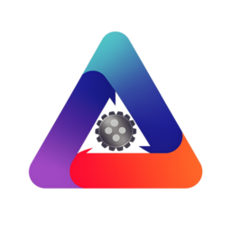

# ATVISION
RoboMaster Vision System Based On ROS2


## 简介
主要框架基于 rm_vision ，fyt_vision , 适配队内车车的视觉系统

### Development
持续开发中

#### Requirements

- x86-64
- Linux

#### Docker Build

由于Docker对部分国家地区有访问限制，需要手动配置代理，
且Ubuntu22.04LTS默认安装的Docker版本低于所需的构建版本(Mount功能缺失)，
所以请按照[Docker安装并配置代理](docs/zh_cn/docker_install.md)安装最新版的Docker，并配置代理。
Docker安装完成后，构建即可。

```sh
docker build . -t atvision
```

如果出现 docker pull 失败的情况，建议[手动配置镜像源或使用代理](docs/zh_cn/docker_usage.md)


#### Container dev

安装 DevContainer

```sh
code --install-extension ms-vscode-remote.remote-containers
```

或自己手动安装
安装完成后，在项目(atvision)的根目录下，摁ctrl+shift+p打开命令页面
选择 "在容器中重新打开"。随后等待进入容器即可。

进入容器后，可选./vscode中的settings.default.json作为推荐设置进行开发


## 一些待完善的工作

- [] 将Solver与状态估计器解耦，在rm_gimbal包中添加二次规划功能

- [] ros bag 回放

- [] 全向感知

- [] 在线手眼标定 from rm_calibration

- [x] 更准确的弹道解算(考虑枪口系)

- [] 调整 UKF，增加拟合判断

- [] 自动测定usb通讯回环延迟以确定时间戳偏移量

- [] 模拟视频发布 pub_video 节点实现

- [] cleanup

- [] 补充开发/使用文档